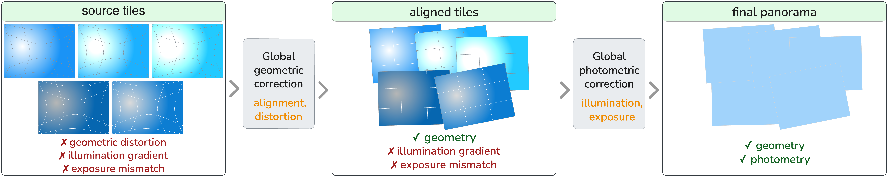
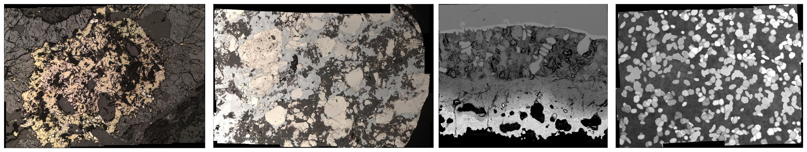

# PRIMO: Panoramic Reconstruction with Integrated Microscopy-Specific Optimization

[](https://pypi.org/project/primo-stitch/)
[](https://pypi.org/project/primo-stitch/)
[](LICENSE)

PRIMO is a modern method and Python library for stitching flat 2D panoramas
across imaging modalities, primarily microscopy. Available on PyPI as
[`primo-stitch`](https://pypi.org/project/primo-stitch/).


*Flow chart of the PRIMO method*

## Installation

```bash
pip install primo-stitch
```

- Python 3.10–3.14.
- If you use a GPU, make sure you have a CUDA-enabled PyTorch
  ([pytorch.org](https://pytorch.org)).
- Model weights are downloaded on the first run — internet access is required.

## Command-line usage

`primo-stitch` is the main entry point.

```bash
# minimal — stitch a folder of tiles into a panorama
primo-stitch --tile_dir path/to/tiles --output_file panorama.jpg

# advanced
primo-stitch \
  --tile_dir path/to/tiles \
  --output_file panorama.png \
  --matcher "efficient loftr" \
  --device cuda:0 \
  --blending_mode full \
  --inference_size 0.5 \
  --batch_size 8 \
  --logfile run.log
```

### Options

| Flag | Default | Description |
|---|---|---|
| `--tile_dir` | *(required)* | Directory with the input tiles |
| `--output_file` | `panorama.jpg` | Output panorama path (extension may be adjusted, e.g. `.png` when alpha is saved) |
| `--cache_dir` | `.cache/` | Directory for intermediate results (created automatically, cleaned up after the run) |
| `--matcher` | `xfeat` | `xfeat` \| `efficient loftr` \| `loftr` |
| `--device` | `cpu` | `cpu`, `cuda`, `cuda:0`, ... |
| `--blending_mode` | `full` | `collage` — fast paste-over, no correction; `mosaic` — photocorrection + hard seams, no blending; `full` — photocorrection + seams + multiband blending |
| `--inference_size` | `0.3` | Matcher input scale relative to the original (`0.25`, `0.5`, `1`, ...) |
| `--batch_size` | `1` | Matcher batch size (higher = faster, more memory) |
| `--save_alpha_channel` / `--no-save_alpha_channel` | off | Save the transparency channel; forces `.png` output in `full` mode |
| `--logfile` | *(none)* | Write a debug log to this file |

## Python API

```python
from primo import Matcher, Stitcher

matcher = Matcher(
    model='xfeat',            # 'xfeat' | 'efficient loftr' | 'loftr'
    device='cuda:0',          # or 'cpu'
    inference_size=0.5,
    batch_size=8,
)

# the alignment device is taken from the matcher
stitcher = Stitcher(
    matcher,
    blending_mode='full',     # 'collage' | 'mosaic' | 'full'
)

stitcher.stitch(
    input_dir='path/to/tiles',
    output_file='panorama.jpg',
)
```

`Matcher` and `Stitcher` expose additional keyword arguments (alignment,
photometric correction, blending) — see their signatures for the full set.

## Authors

- Gleb Nikolaev — Lomonosov Moscow State University
- Savelii Shashkov — Lomonosov Moscow State University
- Dmitriy Korshunov — Geological Institute of the Russian Academy of Sciences
- Andrey Krylov — Lomonosov Moscow State University
- Alexander Khvostikov (corresponding author) — Lomonosov Moscow State University


*Examples of panoramas built in different modalities with the PRIMO method*

## Citation

A paper describing PRIMO is currently under review; full citation details
(venue, year, DOI) will be added once it is published. Until then, please
credit the authors:

```bibtex
@unpublished{primo,
  title  = {PRIMO: Panoramic Reconstruction with Integrated Microscopy-Specific Optimization},
  author = {Nikolaev, Gleb and Shashkov, Savelii and Korshunov, Dmitriy and Krylov, Andrey and Khvostikov, Alexander},
  year   = {2026},
  note   = {Manuscript under review}
}
```

## License

[Apache-2.0](LICENSE); bundled third-party components — see
[THIRD_PARTY_LICENSES.md](THIRD_PARTY_LICENSES.md).
